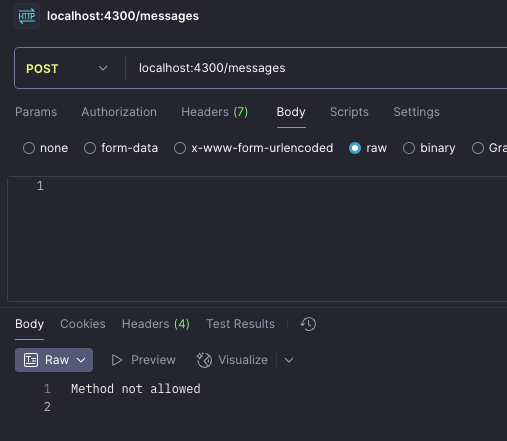
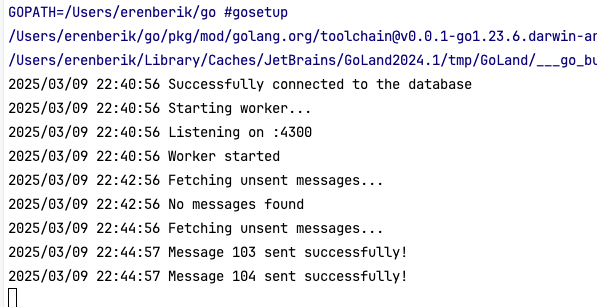
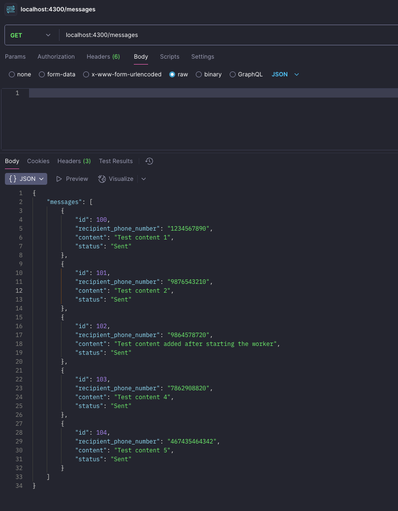

# Insider Assessment - Messaging App

This project uses Docker Compose to spin up a Go-based messaging application with PostgresSQL and Redis. The application connects to a PostgresSQL database and Redis server for message storage and management.

This guide will walk you through the steps to start the Docker containers, initialize the database, and insert some test records.

## Prerequisites

Before you start, ensure you have the following installed:

- [Docker](https://www.docker.com/get-started)
- [Docker Compose](https://docs.docker.com/compose/install/)

## Steps to Set Up the Project

### 1. **Clone the Repository**

Clone this repository to your local machine:

```bash
git clone git@github.com:eren-berik/insider-assessment.git
cd <project_folder> 
```

### 2. **Start Docker Container**

Use the following command to build and start the Docker containers defined in docker-compose.yml:
```bash
docker-compose up --build
```
This command will:

Build the Go application Docker image.

Start PostgreSQL, Redis, and the Go application containers.

Expose ports 5432 (PostgreSQL) and 6379 (Redis) for local connections.

### 3. **Wait for Services to Start**

It may take a minute or two for the services (PostgreSQL, Redis, and the Go app) to start. Docker Compose will display the logs in the terminal. Wait until the following messages are shown for the PostgresSQL and Go services:
PostgresSQL is ready and running on port 5432.
Go application is successfully connected to the database and Redis.

### 4. **Initialize the Database and Insert Records**
Use docker exec to access the PostgreSQL container:
```bash
docker exec -it <postgres_container_id> psql -U postgres -d insider
```

Create the messages table:
```bash
CREATE TABLE messages (
id SERIAL PRIMARY KEY,
phone_number VARCHAR(15),
content TEXT,
status INT
);
```

Insert few records to the table, status 0 is pending, check the code for enum values:
```bash
INSERT INTO messages (phone_number, content, status) VALUES
  ('1234567890', 'Hello, this is a test message', 0),
  ('0987654321', 'This is another test message', 0),
  ('5555555555', 'Test message number three', 0),
  ('6666666666', 'Test message number four', 0);
```

## Screenshots
Here is a screenshot of the app:




